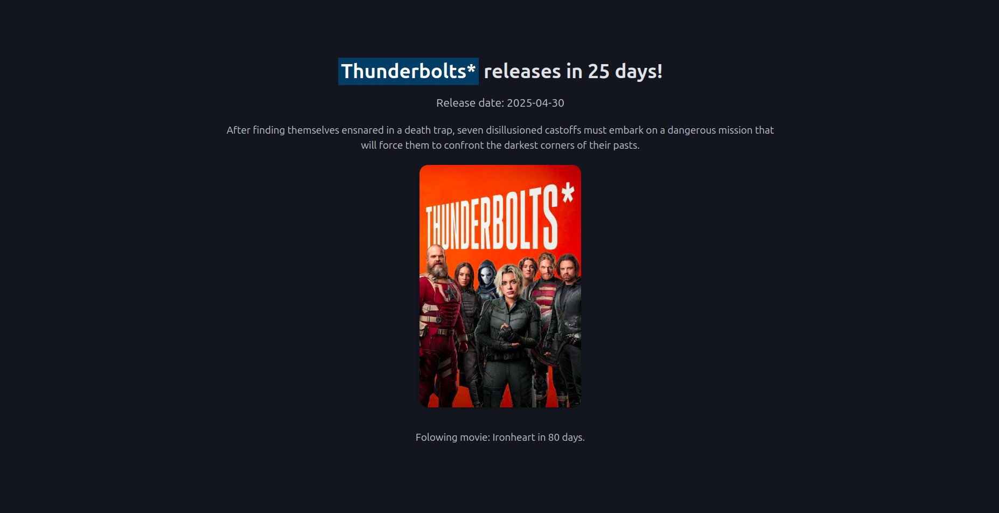

# Next Marvel Movie

This project is a simple PHP web application that displays information about the next Marvel Cinematic Universe (MCU) movie. It fetches data from the [When Is The Next MCU Film API](https://whenisthenextmcufilm.com/api) and presents it in a clean and responsive design.

## Features

- Displays the title, release date, and overview of the next Marvel movie.
- Shows the number of days remaining until the movie's release.
- Includes information about the following Marvel movie.
- Displays the movie poster with a modern design.

## Technologies Used

- **PHP**: For fetching and processing the API data.
- **HTML**: For structuring the web page.
- **CSS**: For styling the application, including a custom stylesheet and [Pico.css](https://picocss.com/) for a classless CSS framework.

## How to Run

1. Clone this repository:
   ```bash
   git clone https://github.com/lmunozm1702/next_marvel_movie.git
   ```
2. Navigate to the project directory:
   ```bash
   cd next_marvel_movie
   ```
3. Start a local PHP server:
   ```bash
   php -S localhost:8000
   ```
4. Open your browser and navigate to `http://localhost:8000`.

## API Reference

This project uses the When Is The Next MCU Film API to fetch movie data. The API provides details such as the title, release date, overview, poster URL, and information about the following movie.

## Screenshots



## Autor

### 👤 Luis Muñoz

- GitHub: [@lmunozm1702](https://github.com/lmunozm1702)
- Twitter: [@lmunozm](https://twitter.com/lmunozm)
- LinkedIn: [luis-munoz-manriquez](https://www.linkedin.com/in/luis-munoz-manriquez)
